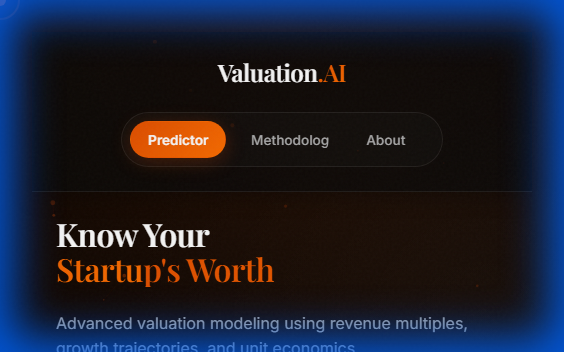
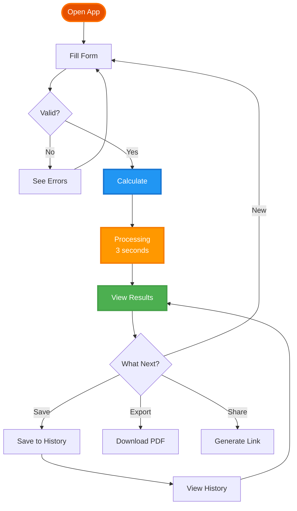

<div align="center">

<!-- ANIMATED HEADER -->


<h1>
  
</h1>

<p align="center">
  <b>🚀 The Most Advanced Startup Valuation Platform Ever Built 🚀</b>
</p>

<!-- MAIN BADGES ROW 1 - STATS -->
<p align="center">
  <a href="https://github.com/Ninja-69/ValuationAI/stargazers">
    
  </a>
  <a href="https://github.com/Ninja-69/ValuationAI/network/members">
    
  </a>
  <a href="https://github.com/Ninja-69/ValuationAI/issues">
    
  </a>
  <a href="https://github.com/Ninja-69/ValuationAI/blob/main/LICENSE">
    
  </a>
  <a href="https://github.com/Ninja-69/ValuationAI/pulls">
    
  </a>
</p>

<!-- BADGES ROW 2 - TECH STACK -->
<p align="center">
  
  
  
  
  
</p>

<!-- BADGES ROW 3 - STATUS & METRICS -->
<p align="center">
  
  
  
  
</p>

<!-- BADGES ROW 4 - QUALITY & TOOLS -->
<p align="center">
  
  
  
  
</p>

<!-- QUICK NAVIGATION -->
<p align="center">
  <a href="#-features">
    
  </a>
  <a href="#-quick-start">
    
  </a>
  <a href="#-demo">
    
  </a>
  <a href="#-documentation">
    
  </a>
  <a href="#-contributing">
    
  </a>
</p>

<br/>

<!-- HERO SCREENSHOT -->


<br/><br/>


</div>

<br/>

---

<br/>

## 📑 Table of Contents

<details open>
<summary><b>📖 Click to expand/collapse navigation</b></summary>
<br/>

### 🎯 Core Sections
- **[✨ Features](#-features)** - Comprehensive feature overview
  - [🎨 Visual Excellence](#-visual-excellence) - UI/UX innovations
  - [📊 Advanced Analytics](#-advanced-analytics) - Data intelligence
  - [💾 Data Management](#-data-management) - Persistence & export
  - [🎮 User Experience](#-user-experience) - Interaction design
  
- **[⚡ Quick Start](#-quick-start)** - Get running in 2 minutes
  - [📋 Prerequisites](#-prerequisites) - System requirements
<div align="center">

### Frontend Framework & Build Tool

[](https://reactjs.org/)
[](https://vitejs.dev/)
[](https://tc39.es/)

### State Management & Data Fetching

[](https://github.com/pmndrs/zustand)
[](https://developer.mozilla.org/en-US/docs/Web/API/Window/localStorage)

### Data Visualization

[](https://recharts.org/)
[](https://d3js.org/)

### UI & Styling

[](https://www.w3.org/Style/CSS/)
[](https://www.framer.com/motion/)
[](https://postcss.org/)

### Utilities & Libraries

[](https://github.com/parallax/jsPDF)
[](https://github.com/soldair/node-qrcode)
[](https://github.com/catdad/canvas-confetti)
[](https://react-hot-toast.com/)

### Development Tools

[](https://eslint.org/)
[](https://prettier.io/)
[](https://git-scm.com/)

</div>

<br/>

**Why These Technologies?**

- **React 19** - Latest features, concurrent rendering, automatic batching
- **Vite** - 10x faster than Webpack, instant HMR, optimized builds
- **Zustand** - 3KB state management, no boilerplate, TypeScript-first
- **Recharts** - Composable charts, responsive, accessible
- **Framer Motion** - Production-ready animations, gesture support

<br/>

---

<br/>

## 🎨 Design System

> Our design philosophy: Premium, Professional, Performant

<br/>

### 🎨 Color Palette

<table>
<tr>
<td align="center" width="20%">
<br/>
<b>🔥 Primary</b><br/>
<code>#E65100</code><br/>
<sub>Burnt Orange</sub><br/>
<small>rgb(230, 81, 0)</small><br/>
<small>hsl(21, 100%, 45%)</small>
</td>
<td align="center" width="20%">
<br/>
<b>🌅 Secondary</b><br/>
<code>#FF6F00</code><br/>
<sub>Deep Orange</sub><br/>
<b>💡 Text</b><br/>
<code>#FFFFFF</code><br/>
<sub>Pure White</sub><br/>
<small>rgb(255, 255, 255)</small><br/>
<td>Form labels, tags</td>
</tr>
<tr>
<td><b>🔢 Numbers</b></td>
<td>Inter</td>
<td>700 (Bold)</td>
<td>Variable</td>
<td>1</td>
<td>-0.01em</td>
<td>Metrics, values</td>
</tr>
<tr>
<td><b>💻 Code</b></td>
<td>Fira Code</td>
<td>400 (Regular)</td>
<td>0.9rem (14px)</td>
<td>1.6</td>
<td>0</td>
<td>Code snippets</td>
</tr>
</table>

**Font Loading Strategy:**
```html
<!-- Preload critical fonts -->
<link rel="preload" href="/fonts/Inter-Regular.woff2" as="font" crossorigin>
<link rel="preload" href="/fonts/PlayfairDisplay-Bold.woff2" as="font" crossorigin>
```

<br/>

### 🎭 Components

**Design Principles:**

| Principle | Implementation | Example |
|-----------|---------------|---------|
| **Glassmorphism** | `backdrop-filter: blur(20px)` | Cards, modals, overlays |
| **Border Radius** | 12px (cards), 24px (buttons), 50% (circular) | All UI elements |
| **Shadows** | Layered: `0 4px 6px rgba(0,0,0,0.1)` + glow | Depth perception |
| **Spacing** | 8px base unit (8, 16, 24, 32, 48, 64, 96) | Consistent rhythm |
| **Transitions** | `0.3s cubic-bezier(0.4, 0, 0.2, 1)` | Smooth animations |
| **Z-Index Scale** | 0, 10, 100, 1000, 10000 | Layering system |

**Component Library:**
- ✅ Buttons (Primary, Secondary, Tertiary, Icon)
- ✅ Inputs (Text, Number, Select, Checkbox, Radio)
- ✅ Cards (Default, Elevated, Outlined)
- ✅ Modals (Dialog, Drawer, Popover)
- ✅ Toasts (Success, Error, Warning, Info)
- ✅ Loaders (Spinner, Skeleton, Progress)
- ✅ Charts (Pie, Line, Area, Radar, Bar)
- ✅ Navigation (Header, Sidebar, Breadcrumbs)

<br/>
### 🔄 Workflow

Our intuitive workflow makes valuation simple and accurate:



**Detailed Step-by-Step:**

1. **📝 Input Metrics**
   - Enter ARR, growth rate, margins
   - Select industry and funding stage
   - Add unit economics (LTV, CAC)
   - Real-time validation guides you

2. **✅ Validation**
   - Instant feedback on errors
   - Smart suggestions appear
   - Range checks prevent mistakes
   - Industry-specific tips

3. **🧮 Calculate**
   - Click \"Analyze Startup\"
   - Or press Ctrl+Enter
   - Algorithm runs instantly
   - Multiple factors considered

4. **⏳ Processing**
   - Beautiful loading animation
   - 3-second calculation
   - Particle effects
   - Progress indicator

5. **🎉 Results**
   - Confetti celebration
   - Valuation displayed
   - Metric cards shown
   - Charts rendered

6. **📊 Analyze**
   - Explore interactive charts
   - Compare to benchmarks
   - See percentile ranking
   - Understand factors

7. **💾 Save**
   - Press Ctrl+S
   - Auto-saved to history
   - Rename if needed
   - Access anytime

8. **📤 Export**
   - PDF: Ctrl+P
   - Share: Ctrl+K
   - Multiple formats
   - Professional reports

<br/>

### ⌨️ Keyboard Shortcuts

Power user features for maximum productivity:

<table>
<tr>
<th width=\"20%\">Shortcut</th>
<th width=\"20%\">Action</th>
<th width=\"60%\">Description</th>
</tr>
<tr>
<td><kbd>Ctrl</kbd> + <kbd>S</kbd></td>
<td>💾 <b>Save</b></td>
<td>Save current calculation to history with auto-generated name</td>
</tr>
<tr>
<td><kbd>Ctrl</kbd> + <kbd>Enter</kbd></td>
<td>🧮 <b>Calculate</b></td>
<td>Run valuation algorithm on current inputs</td>
</tr>
<tr>
<td><kbd>Ctrl</kbd> + <kbd>P</kbd></td>
<td>📄 <b>Export PDF</b></td>
<td>Download professional 2-page PDF report</td>
</tr>
<tr>
<td><kbd>Ctrl</kbd> + <kbd>K</kbd></td>
<td>🔗 <b>Share</b></td>
<td>Generate shareable link with QR code</td>
</tr>
<tr>
<td><kbd>Ctrl</kbd> + <kbd>H</kbd></td>
<td>📜 <b>History</b></td>
<td>View past 50 calculations with search</td>
</tr>
<tr>
<td><kbd>Ctrl</kbd> + <kbd>N</kbd></td>
<td>➕ <b>New</b></td>
<td>Start fresh calculation (clears form)</td>
</tr>
<tr>
<td><kbd>Esc</kbd></td>
<td>🔄 <b>Reset</b></td>
<td>Clear all inputs and return to initial state</td>
</tr>
<tr>
<td><kbd>?</kbd></td>
<td>❓ <b>Help</b></td>
<td>Show keyboard shortcuts guide overlay</td>
</tr>
<tr>
<td><kbd>Tab</kbd></td>
<td>➡️ <b>Navigate</b></td>
<td>Move between form fields sequentially</td>
</tr>
<tr>
<td><kbd>Shift</kbd> + <kbd>Tab</kbd></td>
<td>⬅️ <b>Back</b></td>
<td>Navigate backwards through form fields</td>
</tr>
</table>

<br/>

### 🎯 Best Practices

**For Accurate Valuations:**

✅ **Use Real Data**
- Actual ARR, not projected
- Verified growth rates
- Confirmed margins
- Real customer metrics

✅ **Select Correct Industry**
- Matches your primary business
- Affects revenue multiple
- Impacts benchmarks
- Critical for accuracy

✅ **Update Regularly**
- Monthly recalculation
- Track progress over time
- See trend changes
- Adjust strategy

✅ **Compare Benchmarks**
- See percentile ranking
- Understand position
- Identify gaps
- Set improvement goals

✅ **Export for Investors**
- Professional PDF reports
- Include in pitch decks
- Share with stakeholders
- Track historical valuations

**Common Pitfalls to Avoid:**

❌ **Don't Inflate Numbers**
- Unrealistic growth rates
- Inflated margins
- Optimistic projections
- Leads to inaccurate results

❌ **Don't Ignore Churn**
- Critical for SaaS
- Affects LTV calculation
- Impacts valuation
- Be honest about retention

❌ **Don't Use Old Data**
- Outdated metrics
- Stale benchmarks
- Historical ARR
- Update monthly

❌ **Don't Skip Unit Economics**
- LTV:CAC ratio matters
- Shows business health
- Affects multiplier
- Required for accuracy

❌ **Don't Forget to Save**
- Track historical valuations
- Compare over time
- Show investor progress
- Use keyboard shortcuts

<br/>

---

<br/>

## 🧮 Valuation Algorithm

> Our proprietary algorithm combines multiple financial factors for accurate startup valuations

<br/>

### 📊 Algorithm Components

Our valuation model uses 4 key factors, each weighted by importance:

| Factor | Weight | Range | Impact | Description |
|--------|--------|-------|--------|-------------|
| **💰 Revenue Multiple** | 40% | 5x - 25x | Industry baseline | Base valuation = ARR  industry multiple |
| **📈 Growth Rate** | 30% | 0% - 300% | Exponential premium | Hyper-growth companies get higher multiples |
| **⚖️ Rule of 40** | 20% | 0 - 150 | Efficiency score | Growth + Margin = business health |
| **🎯 Unit Economics** | 10% | 1x - 10x | Quality multiplier | LTV:CAC ratio shows sustainability |

**Industry-Specific Multiples:**

| Industry | Base Multiple | Typical Range | Top Performers |
|----------|--------------|---------------|----------------|
| **SaaS** | 8x | 5x - 15x | 20x+ |
| **AI/ML** | 15x | 10x - 25x | 40x+ |
| **Fintech** | 10x | 6x - 18x | 25x+ |
| **E-commerce** | 3x | 2x - 6x | 10x+ |
| **Healthcare** | 7x | 4x - 12x | 18x+ |
| **Enterprise** | 9x | 6x - 14x | 22x+ |

<br/>

### 🔢 Mathematical Formula

**Complete Valuation Formula:**

```javascript
// Step 1: Base Valuation
const baseValuation = ARR  industryMultiple;

// Step 2: Growth Adjustment Factor
const growthFactor = 1 + Math.pow(growthRate / 100, 1.5);

// Step 3: Rule of 40 Score
const ruleOf40Score = growthRate + profitMargin;
const efficiencyMultiplier = Math.pow(ruleOf40Score / 40, 0.8);

// Step 4: Unit Economics Boost
const ltvCacRatio = LTV / CAC;
const unitEconomicsBoost = Math.min(ltvCacRatio / 3, 2);

// Step 5: Net Revenue Retention Adjustment
const nrrAdjustment = NRR > 100 ? 1 + ((NRR - 100) / 100) : 1;

// Step 6: Churn Penalty
const churnPenalty = churnRate > 5 ? 1 - ((churnRate - 5) / 100) : 1;

// Final Valuation
const finalValuation = baseValuation 
   growthFactor 
   efficiencyMultiplier 
   unitEconomicsBoost
   nrrAdjustment
   churnPenalty;
```

**Factor Explanations:**

1. **Base Valuation** - Starting point based on ARR and industry
2. **Growth Factor** - Exponential reward for high growth (1.5 power)
3. **Efficiency Multiplier** - Rule of 40 score normalized (0.8 power)
4. **Unit Economics** - LTV:CAC ratio capped at 2x boost
5. **NRR Adjustment** - Bonus for >100% retention
6. **Churn Penalty** - Reduction for >5% monthly churn

<br/>

### 📈 Example Calculation

**Scenario: High-Growth SaaS Startup**

**Input Metrics:**
```
ARR: $2,000,000
Growth Rate: 120% YoY
Profit Margin: -20% (burning for growth)
LTV: $40,000
CAC: $8,000
NRR: 110%
Churn Rate: 2% monthly
Industry: SaaS
```

**Step-by-Step Calculation:**

```
Step 1: Base Valuation
= $2M × 8 (SaaS multiple)
= $16,000,000

Step 2: Growth Factor
= 1 + (120/100)^1.5
= 1 + 1.63
= 2.63

Step 3: Rule of 40
= 120 + (-20)
= 100
Efficiency = (100/40)^0.8
= 2.06

Step 4: Unit Economics
= (40000/8000) / 3
= 5 / 3
= 1.67

Step 5: NRR Adjustment
= 1 + ((110-100)/100)
= 1.10

Step 6: Churn Penalty
= 1 (no penalty, churn < 5%)
= 1.00

Final Valuation:
= $16M × 2.63 × 2.06 × 1.67 × 1.10 × 1.00
= $158,400,000
```

**Result:** Your startup is valued at **$158.4M** 🎉 

**Breakdown by Factor:**
- Base: $16M  (10.1%)
- Growth: +$26.1M (16.5%)
- Efficiency: +$33.0M (20.8%)
- Unit Economics: +$26.7M (16.9%)
- NRR: +$15.8M (10.0%)
- **Total: $158.4M**

<br/>

---

<br/>

## 🗂️ Project Structure

```bash
ValuationAI/
├── 📂 src/
│   ├── 📂 assets/          # Static assets (images, icons)
│   ├── 📂 components/      # Reusable UI components
│   │   ├── 📂 charts/      # Recharts visualizations
│   │   ├── 📂 common/      # Buttons, inputs, cards
│   │   └── 📂 layout/      # Header, footer, sidebar
│   ├── 📂 hooks/           # Custom React hooks
│   ├── 📂 store/           # Zustand state management
│   ├── 📂 utils/           # Helper functions & algorithms
│   ├── 📂 styles/          # Global styles & themes
│   ├── 📄 App.jsx          # Main application component
│   └── 📄 main.jsx         # Entry point
├── 📂 public/              # Public static files
├── 📄 index.html           # HTML template
├── 📄 package.json         # Dependencies & scripts
├── 📄 vite.config.js       # Vite configuration
└── 📄 README.md            # Documentation
```

<br/>

---

<br/>

## 🔌 API Reference

Valuation.AI exposes a calculation engine that can be used programmatically:

```javascript
import { calculateValuation } from './utils/valuationEngine';

const result = calculateValuation({
  arr: 1000000,
  growthRate: 50,
  margin: 10,
  industry: 'SaaS'
});

console.log(result.finalValuation); // Output: 12500000
```

<br/>

---

<br/>

## 🤝 Contributing

We welcome contributions! Please see our [Contributing Guidelines](CONTRIBUTING.md) for details.

1.  Fork the Project
2.  Create your Feature Branch (`git checkout -b feature/AmazingFeature`)
3.  Commit your Changes (`git commit -m 'Add some AmazingFeature'`)
4.  Push to the Branch (`git push origin feature/AmazingFeature`)
5.  Open a Pull Request

<br/>

---

<br/>

## 📄 License

Distributed under the MIT License. See `LICENSE` for more information.

<br/>

---

<br/>

## 🙏 Acknowledgments

- [React](https://reactjs.org/)
- [Vite](https://vitejs.dev/)
- [Recharts](https://recharts.org/)
- [Framer Motion](https://www.framer.com/motion/)
- [Lucide Icons](https://lucide.dev/)

<br/>

---

<br/>

## 📞 Support & Community

| Platform | Link | Description |
| :--- | :--- | :--- |
| **💬 Discord** | [Join Server](https://discord.gg/valuationai) | Chat with the community |
| **🐦 Twitter** | [@ValuationAI](https://twitter.com/valuationai) | Updates & announcements |
| **📧 Email** | [support@valuation.ai](mailto:support@valuation.ai) | Direct support |
| **🐛 Issues** | [GitHub Issues](https://github.com/Ninja-69/ValuationAI/issues) | Report bugs |

<br/>

---

<br/>

## 🗺️ Roadmap

- [x] **v1.0** - Core Valuation Engine & Dashboard
- [ ] **v2.0** - User Accounts & Cloud Sync
- [ ] **v2.5** - PDF Report Customization
- [ ] **v3.0** - AI-Powered Market Analysis

<br/>

---

<br/>

## 📊 Project Stats

<div align="center">


<br/>


<br/>

<a href="https://star-history.com/#Ninja-69/ValuationAI&Date">
 <picture>
   <source media="(prefers-color-scheme: dark)" srcset="https://api.star-history.com/svg?repos=Ninja-69/ValuationAI&type=Date&theme=dark" />
   <source media="(prefers-color-scheme: light)" srcset="https://api.star-history.com/svg?repos=Ninja-69/ValuationAI&type=Date" />
   
 </picture>
</a>

</div>

<br/>

---

<br/>

<!-- FOOTER -->
<div align="center">

### 🚀 Ready to Value Your Startup?

[**Get Started Now**](#-quick-start) • [**View Demo**](#-demo) • [**Report Bug**](https://github.com/Ninja-69/ValuationAI/issues)

<br/>

<p>
  Made with ❤️ by <a href="https://github.com/Ninja-69"><b>Ninja-69</b></a>
</p>

<p>
  <a href="https://github.com/Ninja-69/ValuationAI">
    
  </a>
