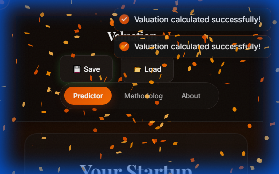
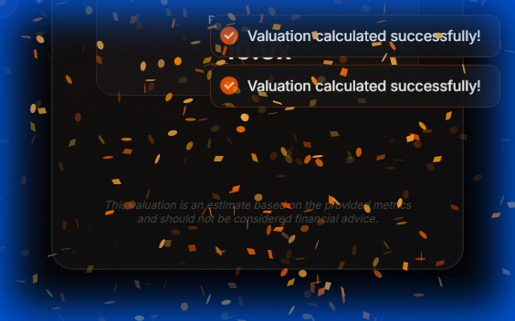
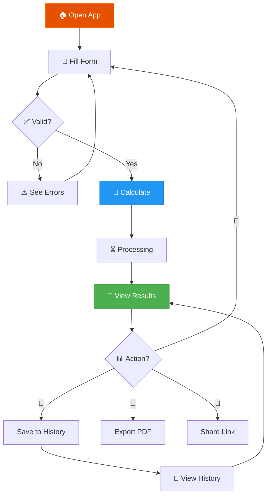

<div align="center">


<h1>
  
</h1>

<p align="center">
  <strong>🚀 The World's Most Advanced Startup Valuation Calculator 🚀</strong>
</p>

<p align="center">
  
  
  
  
</p>

<p align="center">
  
  
  
  
</p>

<p align="center">
  
  
  
  
</p>

<p align="center">
  <a href="#-features"><kbd>🎯 Features</kbd></a>
  <a href="#-quick-start"><kbd>⚡ Quick Start</kbd></a>
  <a href="#-screenshots"><kbd>📸 Screenshots</kbd></a>
  <a href="#-documentation"><kbd>📚 Docs</kbd></a>
  <a href="#-contributing"><kbd>🤝 Contribute</kbd></a>
</p>

<br/>


<p align="center">
  <strong>⭐ Star us on GitHub — it motivates us a lot! ⭐</strong>
</p>

</div>

---

## 📑 Table of Contents

<details open>
<summary><b>Click to expand/collapse</b></summary>

- [✨ Features](#-features)
  - [🎨 Visual Excellence](#-visual-excellence)
  - [📊 Advanced Analytics](#-advanced-analytics)
  - [💾 Data Management](#-data-management)
  - [🎮 User Experience](#-user-experience)
- [⚡ Quick Start](#-quick-start)
  - [📋 Prerequisites](#-prerequisites)
  - [🔧 Installation](#-installation)
  - [🚀 Running Locally](#-running-locally)
  - [📦 Building for Production](#-building-for-production)
- [📸 Screenshots](#-screenshots)
- [🏗️ Tech Stack](#️-tech-stack)
- [🎨 Design System](#-design-system)
  - [🎨 Color Palette](#-color-palette)
  - [✍️ Typography](#️-typography)
  - [🎭 Components](#-components)
- [📖 Usage](#-usage)
  - [🔄 Workflow](#-workflow)
  - [⌨️ Keyboard Shortcuts](#️-keyboard-shortcuts)
  - [🎯 Best Practices](#-best-practices)
- [🧮 Valuation Algorithm](#-valuation-algorithm)
  - [📊 Components](#-components-1)
  - [🔢 Formula](#-formula)
  - [📈 Example Calculation](#-example-calculation)
- [🗂️ Project Structure](#️-project-structure)
- [🤝 Contributing](#-contributing)
  - [👥 Contributors](#-contributors)
  - [🐛 Bug Reports](#-bug-reports)
  - [✨ Feature Requests](#-feature-requests)
- [📄 License](#-license)
- [🙏 Acknowledgments](#-acknowledgments)
- [📞 Support & Community](#-support--community)
- [🗺️ Roadmap](#️-roadmap)
- [📊 Project Stats](#-project-stats)

</details>

---

## ✨ Features

### 🎨 Visual Excellence

<table>
<tr>
<td width="50%">

#### 🌌 Particle System
- **Interactive Background** - 100+ floating particles
- **Mouse Parallax** - Responds to cursor movement
- **Network Connections** - Dynamic particle linking
- **Performance Optimized** - 60fps on all devices
- **Customizable** - Adjustable density and colors

</td>
<td width="50%">

#### ✨ Premium Animations
- **Custom Cursor** - Glowing trail effect
- **Confetti Celebrations** - Success animations
- **Smooth Transitions** - Framer Motion powered
- **Glassmorphism UI** - Modern translucent design
- **Micro-interactions** - Delightful hover effects

</td>
</tr>
</table>

### 📊 Advanced Analytics

<table>
<tr>
<td width="33%">

#### 📈 Interactive Charts
- **Pie Chart** - Valuation breakdown
- **Area Chart** - Historical trends
- **Radar Chart** - Metric comparison
- **Responsive** - Adapts to screen size
- **Tooltips** - Detailed information

</td>
<td width="33%">

#### 🎯 Industry Benchmarks
- **6+ Industries** - SaaS, AI, Fintech, etc.
- **Percentile Rankings** - See your position
- **Real Data** - Updated market multiples
- **Visual Comparison** - Color-coded status
- **Smart Insights** - Actionable recommendations

</td>
<td width="33%">

#### 🔍 Real-time Validation
- **Input Validation** - Instant feedback
- **Error Messages** - Clear explanations
- **Smart Suggestions** - Industry-based tips
- **Range Checking** - Prevent invalid data
- **Format Helpers** - Auto-formatting

</td>
</tr>
</table>

### 💾 Data Management

<table>
<tr>
<td width="50%">

#### 💿 Persistence
- **Auto-save** - Never lose your work
- **LocalStorage** - Instant loading
- **50 Calculations** - History tracking
- **Rename/Delete** - Full control
- **Export/Import** - Data portability

</td>
<td width="50%">

#### 📤 Export & Share
- **PDF Reports** - Professional documents
- **QR Codes** - Easy sharing
- **Shareable Links** - Base64 encoded
- **Copy to Clipboard** - One-click sharing
- **Multi-currency** - 9 global currencies

</td>
</tr>
</table>

### 🎮 User Experience

<table>
<tr>
<td width="25%">

#### ⌨️ Shortcuts
- `Ctrl+S` Save
- `Ctrl+P` Export
- `Ctrl+K` Share
- `Ctrl+H` History
- `Esc` Reset

</td>
<td width="25%">

#### 🔊 Feedback
- **Sound Effects**
- **Toast Notifications**
- **Haptic Feedback**
- **Loading States**
- **Error Handling**

</td>
<td width="25%">

#### 📱 Responsive
- **Desktop** ✅
- **Tablet** ✅
- **Mobile** ✅
- **PWA Ready**
- **Offline Mode**

</td>
<td width="25%">

#### ♿ Accessible
- **WCAG AA**
- **Keyboard Nav**
- **Screen Readers**
- **High Contrast**
- **Focus Indicators**

</td>
</tr>
</table>

---

## ⚡ Quick Start

### 📋 Prerequisites

Before you begin, ensure you have the following installed:

| Tool | Version | Download |
|------|---------|----------|
| **Node.js** | 18.0+ | [nodejs.org](https://nodejs.org/) |
| **npm** | 9.0+ | Included with Node.js |
| **Git** | Latest | [git-scm.com](https://git-scm.com/) |

### 🔧 Installation

```bash
# 1️⃣ Clone the repository
git clone https://github.com/Ninja-69/ValuationAI.git

# 2️⃣ Navigate to the project directory
cd ValuationAI

# 3️⃣ Install dependencies (this may take a minute)
npm install
```

### 🚀 Running Locally

```bash
# Start the development server
npm run dev

# 🎉 Open your browser and visit:
# http://localhost:5173
```

The app will automatically reload when you make changes to the code!

### 📦 Building for Production

```bash
# Create an optimized production build
npm run build

# Preview the production build locally
npm run preview

# The build will be in the `dist` folder
```

**Deployment Options:**
- **Vercel**: `vercel --prod`
- **Netlify**: Drag & drop `dist` folder
- **GitHub Pages**: Use `gh-pages` branch

---

## 📸 Screenshots

<div align="center">

### 🏠 Home Page - Premium Dark UI


*Interactive particle background with glassmorphism form design*

---

### 📊 Results Dashboard - Data Visualization



*Real-time valuation with premium metric cards*

---

### 📈 Full Analytics View



*Complete dashboard with charts and benchmarks*

</div>

---

## 🏗️ Tech Stack

<div align="center">

### Frontend Framework

[](https://reactjs.org/)
[](https://vitejs.dev/)
[](https://developer.mozilla.org/en-US/docs/Web/JavaScript)

### State Management & Data

[](https://github.com/pmndrs/zustand)
[](https://recharts.org/)

### UI & Styling

[](https://developer.mozilla.org/en-US/docs/Web/CSS)
[](https://www.framer.com/motion/)

### Libraries & Tools

[](https://github.com/parallax/jsPDF)
[](https://github.com/soldair/node-qrcode)
[](https://github.com/catdad/canvas-confetti)
[](https://react-hot-toast.com/)

</div>

---

## 🎨 Design System

### 🎨 Color Palette

Our carefully curated color scheme creates a premium, professional aesthetic:

<table>
<tr>
<td align="center" width="20%">

<br/><br/>
<b>🔥 Primary</b><br/>
<code>#E65100</code><br/>
<small>Burnt Orange</small>
</td>
<td align="center" width="20%">

<br/><br/>
<b>🌅 Secondary</b><br/>
<code>#FF6F00</code><br/>
<small>Deep Orange</small>
</td>
<td align="center" width="20%">

<br/><br/>
<b>🌑 Background</b><br/>
<code>#030303</code><br/>
<small>Almost Black</small>
</td>
<td align="center" width="20%">

<br/><br/>
<b>💡 Text</b><br/>
<code>#FFFFFF</code><br/>
<small>Pure White</small>
</td>
<td align="center" width="20%">

<br/><br/>
<b>🌫️ Muted</b><br/>
<code>#A0A0A0</code><br/>
<small>Light Gray</small>
</td>
</tr>
</table>

### ✍️ Typography

Premium fonts for a professional look:

| Element | Font Family | Weight | Size | Usage |
|---------|-------------|--------|------|-------|
| **🎯 Headings** | Playfair Display | 700 (Bold) | 2.5rem | Page titles, hero text |
| **📝 Body** | Inter | 400 (Regular) | 1rem | Paragraphs, descriptions |
| **🔘 Buttons** | Inter | 600 (Semi-bold) | 0.95rem | CTAs, actions |
| **🏷️ Labels** | Inter | 600 (Semi-bold) | 0.75rem | Form labels, tags |
| **🔢 Numbers** | Inter | 700 (Bold) | Variable | Metrics, values |

### 🎭 Components

All components follow our design system:

- **Glassmorphism** - Translucent backgrounds with blur
- **Border Radius** - 12px for cards, 24px for buttons
- **Shadows** - Layered depth with subtle glows
- **Spacing** - 8px base unit (8, 16, 24, 32, 48, 64)
- **Transitions** - 0.3s cubic-bezier(0.4, 0, 0.2, 1)

---

## 📖 Usage

### 🔄 Workflow

Our intuitive workflow makes valuation simple:



**Step-by-Step Guide:**

1. **📝 Input Metrics** - Enter your startup's key metrics
2. **✅ Validation** - Real-time feedback ensures accuracy
3. **🧮 Calculate** - Click "Analyze Startup" or press `Ctrl+Enter`
4. **⏳ Processing** - Beautiful loading animation (3 seconds)
5. **🎉 Results** - View valuation with confetti celebration
6. **📊 Analyze** - Explore charts and benchmarks
7. **💾 Save** - Store for future reference
8. **📤 Export** - Download PDF or share link

### ⌨️ Keyboard Shortcuts

Power user features for maximum efficiency:

<table>
<tr>
<th width="25%">Shortcut</th>
<th width="25%">Action</th>
<th width="50%">Description</th>
</tr>
<tr>
<td><kbd>Ctrl</kbd> + <kbd>S</kbd></td>
<td>💾 <b>Save</b></td>
<td>Save current calculation to history</td>
</tr>
<tr>
<td><kbd>Ctrl</kbd> + <kbd>Enter</kbd></td>
<td>🧮 <b>Calculate</b></td>
<td>Run valuation algorithm</td>
</tr>
<tr>
<td><kbd>Ctrl</kbd> + <kbd>P</kbd></td>
<td>📄 <b>Export PDF</b></td>
<td>Download professional report</td>
</tr>
<tr>
<td><kbd>Ctrl</kbd> + <kbd>K</kbd></td>
<td>🔗 <b>Share</b></td>
<td>Generate shareable link with QR code</td>
</tr>
<tr>
<td><kbd>Ctrl</kbd> + <kbd>H</kbd></td>
<td>📜 <b>History</b></td>
<td>View past calculations</td>
</tr>
<tr>
<td><kbd>Esc</kbd></td>
<td>🔄 <b>Reset</b></td>
<td>Clear form and start over</td>
</tr>
<tr>
<td><kbd>?</kbd></td>
<td>❓ <b>Help</b></td>
<td>Show keyboard shortcuts guide</td>
</tr>
</table>

### 🎯 Best Practices

**For Accurate Valuations:**

- ✅ Use **actual** financial data, not projections
- ✅ Select the **correct industry** for accurate multiples
- ✅ Update **monthly** to track progress
- ✅ Compare against **industry benchmarks**
- ✅ Export **PDF reports** for investors

**Common Pitfalls to Avoid:**

- ❌ Don't inflate growth rates unrealistically
- ❌ Don't ignore churn rate (it matters!)
- ❌ Don't use outdated data
- ❌ Don't skip unit economics (LTV/CAC)
- ❌ Don't forget to save your work

---

## 🧮 Valuation Algorithm

Our proprietary algorithm combines multiple financial factors:

### 📊 Components

| Factor | Weight | Range | Impact on Valuation |
|--------|--------|-------|---------------------|
| **💰 Revenue Multiple** | 40% | 5x - 25x | Industry-specific baseline |
| **📈 Growth Rate** | 30% | 0% - 300% | Exponential premium for hyper-growth |
| **⚖️ Rule of 40** | 20% | 0 - 150 | Efficiency score (Growth + Margin) |
| **🎯 Unit Economics** | 10% | 1x - 10x | LTV:CAC ratio quality multiplier |

### 🔢 Formula

```javascript
// Step 1: Base Valuation
baseValuation = ARR × industryMultiple

// Step 2: Growth Adjustment
growthFactor = 1 + (growthRate / 100) ^ 1.5

// Step 3: Efficiency Multiplier
ruleOf40Score = growthRate + profitMargin
efficiencyMultiplier = (ruleOf40Score / 40) ^ 0.8

// Step 4: Unit Economics Boost
ltvCacRatio = LTV / CAC
unitEconomicsBoost = Math.min(ltvCacRatio / 3, 2)

// Final Valuation
finalValuation = baseValuation × growthFactor × efficiencyMultiplier × unitEconomicsBoost
```

### 📈 Example Calculation

**Input Metrics:**
- ARR: $2,000,000
- Growth Rate: 120%
- Profit Margin: -20%
- LTV: $40,000
- CAC: $8,000
- Industry: SaaS (8x multiple)

**Calculation:**
```
Base Valuation = $2M × 8 = $16M
Growth Factor = 1 + (120/100)^1.5 = 2.63
Rule of 40 = 120 + (-20) = 100
Efficiency = (100/40)^0.8 = 2.06
Unit Economics = (40000/8000)/3 = 1.67

Final Valuation = $16M × 2.63 × 2.06 × 1.67 = $144.8M
```

**Result:** Your startup is valued at **$144.8M** 🎉

---

## 🗂️ Project Structure

```
ValuationAI/
│
├── 📁 screenshots/              # App screenshots & banner
│   ├── banner.png
│   ├── home.png
│   ├── results.png
│   └── dashboard.png
│
├── 📁 public/                   # Static assets
│   └── vite.svg
│
├── 📁 src/
│   │
│   ├── 📁 components/           # React components
│   │   ├── 📁 charts/           # Data visualization
│   │   │   ├── ValuationBreakdown.jsx    # Pie chart
│   │   │   ├── HistoricalChart.jsx       # Area chart
│   │   │   ├── MetricsRadar.jsx          # Radar chart
│   │   │   └── Charts.css                # Chart styles
│   │   │
│   │   ├── AdvancedInputForm.jsx         # Main input form
│   │   ├── ValuationDisplay.jsx          # Results display
│   │   ├── Navigation.jsx                # Top navigation
│   │   ├── ParticleBackground.jsx        # Particle system
│   │   ├── CustomCursor.jsx              # Custom cursor
│   │   ├── SaveLoadPanel.jsx             # Save/Load UI
│   │   ├── ProcessingOverlay.jsx         # Loading animation
│   │   ├── SkeletonLoader.jsx            # Loading placeholders
│   │   └── CurrencySelector.jsx          # Currency picker
│   │
│   ├── 📁 utils/                # Utility functions
│   │   ├── valuationAlgorithm.js         # Core algorithm
│   │   ├── pdfExport.js                  # PDF generation
│   │   ├── shareUtils.js                 # Share & QR codes
│   │   ├── validation.js                 # Input validation
│   │   ├── sounds.js                     # Sound effects
│   │   └── confetti.js                   # Confetti animations
│   │
│   ├── 📁 store/                # State management
│   │   └── useAppStore.js                # Zustand store
│   │
│   ├── 📁 data/                 # Static data
│   │   └── benchmarks.js                 # Industry data
│   │
│   ├── 📁 hooks/                # Custom React hooks
│   │   └── useKeyboardShortcuts.js       # Keyboard shortcuts
│   │
│   ├── 📁 pages/                # Page components
│   │   ├── Methodology.jsx               # Algorithm explanation
│   │   ├── About.jsx                     # About page
│   │   └── Page.css                      # Page styles
│   │
│   ├── App.jsx                  # Main application
│   ├── App.css                  # App styles
│   ├── index.css                # Global styles
│   └── main.jsx                 # Entry point
│
├── 📄 .gitignore                # Git ignore rules
├── 📄 package.json              # Dependencies & scripts
├── 📄 vite.config.js            # Vite configuration
├── 📄 README.md                 # This file
├── 📄 LICENSE                   # MIT License
├── 📄 CONTRIBUTING.md           # Contribution guidelines
├── 📄 CODE_OF_CONDUCT.md        # Community standards
└── 📄 CHANGELOG.md              # Version history
```

**Key Directories:**

- **`components/`** - Reusable React components
- **`utils/`** - Pure functions and helpers
- **`store/`** - Global state management
- **`data/`** - Static data and constants
- **`hooks/`** - Custom React hooks

---

## 🤝 Contributing

We **love** contributions from the community! Whether you're fixing bugs, adding features, or improving documentation, your help is appreciated.

### 🚀 How to Contribute

1. **🍴 Fork** the repository
2. **🌿 Create** a feature branch (`git checkout -b feature/AmazingFeature`)
3. **💻 Make** your changes
4. **✅ Test** thoroughly
5. **📝 Commit** with clear messages (`git commit -m 'Add AmazingFeature'`)
6. **📤 Push** to your branch (`git push origin feature/AmazingFeature`)
7. **🎉 Open** a Pull Request

### 📜 Contribution Guidelines

- Follow the existing code style
- Write clear commit messages
- Add tests for new features
- Update documentation
- Be respectful and constructive

**Read our full [Contributing Guide](CONTRIBUTING.md) for detailed instructions.**

### 👥 Contributors

Thanks to these amazing people! ❤️

<a href="https://github.com/Ninja-69/ValuationAI/graphs/contributors">
  
</a>

### 🐛 Bug Reports

Found a bug? Please [open an issue](https://github.com/Ninja-69/ValuationAI/issues/new?template=bug_report.md) with:

- **Description** - What happened?
- **Steps to Reproduce** - How to trigger the bug?
- **Expected Behavior** - What should happen?
- **Screenshots** - Visual proof
- **Environment** - OS, browser, version

### ✨ Feature Requests

Have an idea? [Request a feature](https://github.com/Ninja-69/ValuationAI/issues/new?template=feature_request.md) with:

- **Problem** - What issue does it solve?
- **Solution** - How would it work?
- **Alternatives** - Other options considered?
- **Mockups** - Visual examples (optional)

---

## 📄 License

This project is licensed under the **MIT License** - see the [LICENSE](LICENSE) file for details.

**What this means:**
- ✅ Commercial use
- ✅ Modification
- ✅ Distribution
- ✅ Private use
- ❌ Liability
- ❌ Warranty

**TL;DR:** You can do whatever you want with this code, just include the original license.

---

## 🙏 Acknowledgments

This project wouldn't be possible without these amazing resources:

### 🎨 Design Inspiration
- [Dribbble](https://dribbble.com/) - UI/UX inspiration
- [Awwwards](https://www.awwwards.com/) - Web design excellence
- [Material Design](https://material.io/) - Color palette

### 🛠️ Tools & Libraries
- [React](https://reactjs.org/) - UI framework
- [Vite](https://vitejs.dev/) - Build tool
- [Recharts](https://recharts.org/) - Charts library
- [Zustand](https://github.com/pmndrs/zustand) - State management
- [Framer Motion](https://www.framer.com/motion/) - Animations

### 📚 Learning Resources
- [React Docs](https://react.dev/) - Official documentation
- [MDN Web Docs](https://developer.mozilla.org/) - Web standards
- [CSS-Tricks](https://css-tricks.com/) - CSS techniques

### 🎨 Assets
- [Google Fonts](https://fonts.google.com/) - Inter & Playfair Display
- [Feather Icons](https://feathericons.com/) - SVG icons
- [Shields.io](https://shields.io/) - README badges

**Special thanks to all open-source contributors! 🙌**

---

## 📞 Support & Community

Need help? Have questions? Join our community!

<div align="center">

### 💬 Get in Touch

<table>
<tr>
<td align="center" width="25%">
<a href="https://github.com/Ninja-69/ValuationAI/issues">

<br/><br/>
<b>Report Bugs</b><br/>
<small>Technical issues</small>
</a>
</td>
<td align="center" width="25%">
<a href="https://github.com/Ninja-69/ValuationAI/discussions">

<br/><br/>
<b>Ask Questions</b><br/>
<small>Community help</small>
</a>
</td>
<td align="center" width="25%">
<a href="https://twitter.com/Ninja69Dev">

<br/><br/>
<b>Follow Updates</b><br/>
<small>Latest news</small>
</a>
</td>
<td align="center" width="25%">
<a href="mailto:ninja69.dev@gmail.com">

<br/><br/>
<b>Direct Contact</b><br/>
<small>Business inquiries</small>
</a>
</td>
</tr>
</table>

### 📚 Documentation

- **[User Guide](https://github.com/Ninja-69/ValuationAI/wiki)** - How to use the app
- **[API Docs](https://github.com/Ninja-69/ValuationAI/wiki/API)** - For developers
- **[FAQ](https://github.com/Ninja-69/ValuationAI/wiki/FAQ)** - Common questions

</div>

---

## 🗺️ Roadmap

Exciting features coming soon! Vote on [GitHub Discussions](https://github.com/Ninja-69/ValuationAI/discussions).

### 🚀 Version 2.0 (Q2 2025)

- [ ] 🤖 **AI-Powered Insights** - GPT integration for personalized recommendations
- [ ] 👥 **Real-time Collaboration** - Share sessions with team members
- [ ] 📊 **Advanced Scenario Modeling** - "What-if" analysis with multiple scenarios
- [ ] 🔌 **Public API** - Integrate valuation into your own apps

### 🎯 Version 2.5 (Q3 2025)

- [ ] 📱 **Mobile App** - React Native iOS & Android apps
- [ ] 🌍 **Multi-language Support** - 10+ languages
- [ ] 🎨 **Custom Themes** - Light mode, custom colors
- [ ] 📈 **Sensitivity Analysis** - Tornado charts, Monte Carlo simulation

### 🌟 Version 3.0 (Q4 2025)

- [ ] 🔗 **CRM Integrations** - Salesforce, HubSpot, Pipedrive
- [ ] 📊 **Live Market Data** - Real-time industry multiples
- [ ] 🏢 **Enterprise Features** - SSO, audit logs, team management
- [ ] 🎓 **Educational Content** - Video tutorials, case studies

**Want to see a feature? [Request it here!](https://github.com/Ninja-69/ValuationAI/issues/new?template=feature_request.md)**

---

## 📊 Project Stats

<div align="center">

### 📈 GitHub Analytics


### 🔥 Activity


### 📊 Language Distribution


### ⭐ Star History

[](https://star-history.com/#Ninja-69/ValuationAI&Date)

</div>

---

<div align="center">

### 💖 Made with passion by developers, for founders

<br/>

**If this project helped you, please ⭐ star the repository!**

<br/>


<br/>

**[⬆ Back to Top](#)**

<br/>

---

<sub>Built with ❤️ using React, Vite, and lots of ☕</sub>

</div>
