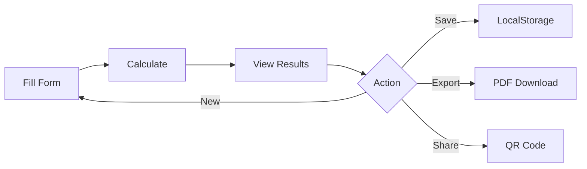

<div align="center">

# 🚀 Valuation.AI

### *The World's Most Advanced Startup Valuation Calculator*


<br />


<br />
<br />

**[🌐 Live Demo](#) • [📖 Documentation](#features) • [🐛 Report Bug](https://github.com/yourusername/valuation-ai/issues) • [✨ Request Feature](https://github.com/yourusername/valuation-ai/issues)**

<br />


<br />

### ⭐ If you find this project useful, please consider giving it a star!

</div>

---

## 📋 Table of Contents

- [✨ Features](#-features)
- [🎯 Quick Start](#-quick-start)
- [📸 Screenshots](#-screenshots)
- [🏗️ Tech Stack](#️-tech-stack)
- [🎨 Design System](#-design-system)
- [📖 Usage](#-usage)
- [🧮 Algorithm](#-algorithm)
- [🗂️ Project Structure](#️-project-structure)
- [🤝 Contributing](#-contributing)
- [📄 License](#-license)
- [🙏 Acknowledgments](#-acknowledgments)
- [📞 Support](#-support)

---

## ✨ Features

<table>
<tr>
<td width="50%">

### 🎨 **Visual Excellence**
- ✅ Particle background with parallax
- ✅ Custom glowing cursor
- ✅ Confetti celebrations
- ✅ Glassmorphism UI
- ✅ 60fps smooth animations
- ✅ Premium color scheme

</td>
<td width="50%">

### 📊 **Advanced Analytics**
- ✅ Industry benchmarks (6+ sectors)
- ✅ Real-time validation
- ✅ Interactive charts (3 types)
- ✅ Percentile rankings
- ✅ Historical tracking
- ✅ Smart suggestions

</td>
</tr>
<tr>
<td width="50%">

### 💾 **Data Management**
- ✅ Save/Load calculations
- ✅ Export to PDF
- ✅ Share with QR codes
- ✅ Multi-currency (9 currencies)
- ✅ Auto-save
- ✅ LocalStorage persistence

</td>
<td width="50%">

### 🎮 **User Experience**
- ✅ Keyboard shortcuts (7+)
- ✅ Sound effects
- ✅ Toast notifications
- ✅ Haptic feedback
- ✅ Responsive design
- ✅ Error boundaries

</td>
</tr>
</table>

---

## 🎯 Quick Start

### Prerequisites


### Installation

```bash
# 1️⃣ Clone the repository
git clone https://github.com/yourusername/valuation-ai.git

# 2️⃣ Navigate to directory
cd valuation-ai

# 3️⃣ Install dependencies
npm install

# 4️⃣ Start development server
npm run dev

# 🎉 Open http://localhost:5173
```

### Build for Production

```bash
# Create optimized build
npm run build

# Preview production build
npm run preview
```

---

## 📸 Screenshots

<div align="center">

### 🏠 Home Page


### 📊 Results Dashboard


### 📈 Charts & Analytics


</div>

---

## 🏗️ Tech Stack

<div align="center">

### Frontend


### State & Data


### UI & Animations


### Tools & Libraries


</div>

---

## 🎨 Design System

### Color Palette

<table>
<tr>
<td align="center" width="20%">
<br />
<b>Primary</b><br />
<code>#E65100</code>
</td>
<td align="center" width="20%">
<br />
<b>Secondary</b><br />
<code>#FF6F00</code>
</td>
<td align="center" width="20%">
<br />
<b>Background</b><br />
<code>#030303</code>
</td>
<td align="center" width="20%">
<br />
<b>Text</b><br />
<code>#FFFFFF</code>
</td>
<td align="center" width="20%">
<br />
<b>Muted</b><br />
<code>#A0A0A0</code>
</td>
</tr>
</table>

### Typography

| Element | Font | Weight | Size |
|---------|------|--------|------|
| **Headings** | Playfair Display | 700 | 2.5rem |
| **Body** | Inter | 400 | 1rem |
| **Buttons** | Inter | 600 | 0.95rem |
| **Labels** | Inter | 600 | 0.75rem |

---

## 📖 Usage

### Basic Workflow



### Keyboard Shortcuts

<table>
<tr>
<th>Shortcut</th>
<th>Action</th>
<th>Description</th>
</tr>
<tr>
<td><kbd>Ctrl</kbd> + <kbd>S</kbd></td>
<td>💾 Save</td>
<td>Save current calculation</td>
</tr>
<tr>
<td><kbd>Ctrl</kbd> + <kbd>Enter</kbd></td>
<td>🧮 Calculate</td>
<td>Run valuation</td>
</tr>
<tr>
<td><kbd>Ctrl</kbd> + <kbd>P</kbd></td>
<td>📄 Export</td>
<td>Download PDF report</td>
</tr>
<tr>
<td><kbd>Ctrl</kbd> + <kbd>K</kbd></td>
<td>🔗 Share</td>
<td>Generate share link</td>
</tr>
<tr>
<td><kbd>Ctrl</kbd> + <kbd>H</kbd></td>
<td>📜 History</td>
<td>View past calculations</td>
</tr>
<tr>
<td><kbd>Esc</kbd></td>
<td>🔄 Reset</td>
<td>Clear form</td>
</tr>
<tr>
<td><kbd>?</kbd></td>
<td>❓ Help</td>
<td>Show shortcuts</td>
</tr>
</table>

---

## 🧮 Algorithm

Our proprietary valuation algorithm combines multiple factors:

```javascript
Valuation = ARR × Base Multiple × Growth Factor × Efficiency Multiplier
```

### Components

| Factor | Weight | Range | Impact |
|--------|--------|-------|--------|
| **Revenue Multiple** | 40% | 5-25x | Industry baseline |
| **Growth Rate** | 30% | 0-300% | Exponential premium |
| **Rule of 40** | 20% | 0-150 | Efficiency score |
| **Unit Economics** | 10% | 1-10x | LTV:CAC ratio |

### Formula Breakdown

1. **Base Multiple** = Industry-specific (SaaS: 8x, AI: 15x, etc.)
2. **Growth Factor** = `1 + (Growth Rate / 100) ^ 1.5`
3. **Efficiency Multiplier** = `(Rule of 40 Score / 40) ^ 0.8`
4. **Final Valuation** = `ARR × Base × Growth × Efficiency`

---

## 🗂️ Project Structure

```
valuation-ai/
├── 📁 public/              # Static assets
├── 📁 src/
│   ├── 📁 components/      # React components
│   │   ├── 📁 charts/      # Chart components
│   │   │   ├── ValuationBreakdown.jsx
│   │   │   ├── HistoricalChart.jsx
│   │   │   └── MetricsRadar.jsx
│   │   ├── AdvancedInputForm.jsx
│   │   ├── ValuationDisplay.jsx
│   │   ├── Navigation.jsx
│   │   ├── ParticleBackground.jsx
│   │   ├── CustomCursor.jsx
│   │   ├── SaveLoadPanel.jsx
│   │   └── SkeletonLoader.jsx
│   ├── 📁 utils/           # Utilities
│   │   ├── valuationAlgorithm.js
│   │   ├── pdfExport.js
│   │   ├── shareUtils.js
│   │   ├── validation.js
│   │   ├── sounds.js
│   │   └── confetti.js
│   ├── 📁 store/           # State management
│   │   └── useAppStore.js
│   ├── 📁 data/            # Static data
│   │   └── benchmarks.js
│   ├── 📁 hooks/           # Custom hooks
│   │   └── useKeyboardShortcuts.js
│   ├── 📁 pages/           # Pages
│   │   ├── Methodology.jsx
│   │   └── About.jsx
│   ├── App.jsx             # Main app
│   ├── App.css             # App styles
│   ├── index.css           # Global styles
│   └── main.jsx            # Entry point
├── 📄 package.json         # Dependencies
├── 📄 vite.config.js       # Vite config
├── 📄 README.md            # This file
├── 📄 LICENSE              # MIT License
├── 📄 CONTRIBUTING.md      # Contribution guide
├── 📄 CODE_OF_CONDUCT.md   # Code of conduct
└── 📄 CHANGELOG.md         # Version history
```

---

## 🤝 Contributing

We welcome contributions! Please see our [Contributing Guide](CONTRIBUTING.md) for details.

### Contributors

<a href="https://github.com/yourusername/valuation-ai/graphs/contributors">
  
</a>

---

## 📄 License

This project is licensed under the MIT License - see the [LICENSE](LICENSE) file for details.

---

## 🙏 Acknowledgments

- **Design Inspiration**: Modern SaaS dashboards
- **Color Palette**: Material Design
- **Icons**: Feather Icons
- **Fonts**: Google Fonts (Inter, Playfair Display)
- **Charts**: Recharts library
- **Animations**: Framer Motion

---

## 📞 Support

<div align="center">

### Need Help?

[](#)
[](mailto:support@valuation-ai.com)
[](#)
[](#)

</div>

---

## 📊 Stats

<div align="center">


</div>

---

## 🗺️ Roadmap

- [ ] 🤖 AI-powered insights with GPT
- [ ] 👥 Real-time collaboration
- [ ] 📱 Mobile app (React Native)
- [ ] 🔌 Public API
- [ ] 📈 Advanced scenario modeling
- [ ] 🔗 CRM integrations
- [ ] 🌍 Multi-language support
- [ ] 🎨 Custom themes

---

<div align="center">

### 💖 Made with love by developers, for founders

**[⬆ Back to Top](#-valuationai)**

---


**If you found this helpful, please ⭐ star the repo!**

</div>
